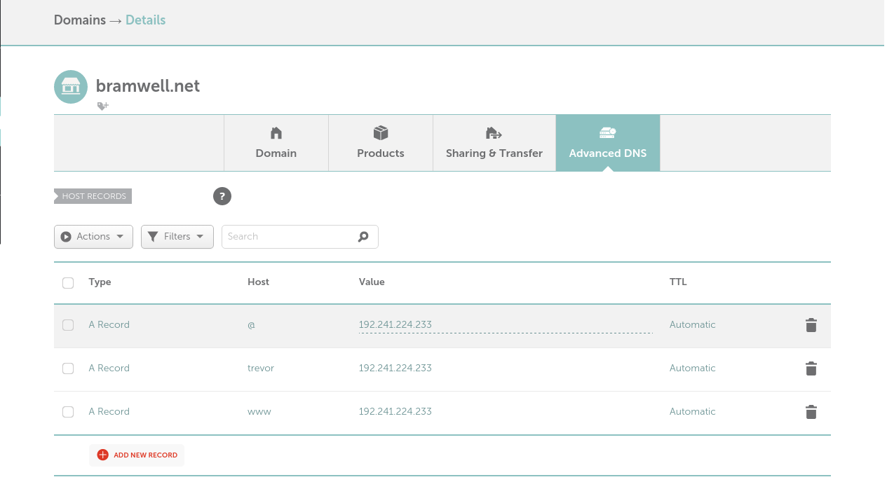

.. _letsencrypt-readthedocs:

Setting up LetsEncrypt with ReadTheDocs
=======================================

With the recent announcement of LetEncrypt coming out of beta, I figured
it was time to give it a shot. I've always been bothered that this site
wasn't served over HTTPS, and LetsEncrypt provides a simple and straight
forward way to make it happen.

This guide documents the steps I took to transition my site on
ReadTheDocs (RTD) to use HTTPS, and closely follows NGINX's `guide`_ on
setting up LetEncrypt.

Before you follow this guide, you should have a few things already in
place:

 1. A site hosted on RTD that you'd like to setup HTTPS for (ex:
    trevorbramwellnet_)

 2. A server with nginx, and git installed.

 3. Control of DNS for your site.

.. _trevorbramwellnet: http://trevorbramwellnet.readthedocs.io/en/latest/
.. _guide: https://www.nginx.com/blog/free-certificates-lets-encrypt-and-nginx/

Alternate Domains
-----------------

ReadTheDocs allows for serving documentation from an `alternate domain`_ using
a DNS CNAME. If you're unfamiliar with DNS, a CNAME record_ is simply a
symlink from one hostname to another.

.. code-block:: console

  bar.example.com  A          192.168.2.23
  foo.example.com  CNAME   bar.example.com

Here's the problem though: If you setup a CNAME for your documentation
hosted on RTD, you can't serve it over HTTPS. This is because RTD uses a
`star cert`_ (\*.readthedocs.org) to enable HTTPS on all the
documentation projects they host. When your browser redirects you to the
real domain, it still looks for an SSL certificate for the original domain.
So in order to get HTTPS to work, you'll instead need to setup NGINX
as a proxy.

.. _alternate domain: https://docs.readthedocs.org/en/latest/alternate_domains.html
.. _record: https://en.wikipedia.org/wiki/CNAME_record
.. _star cert: https://en.wikipedia.org/wiki/Wildcard_certificate

NGINX
-----

To install NGINX on a Debian based operating system, you run:

.. code-block:: console

  $ sudo apt-get install nginx

Configuring NGINX is done through files under ``/etc/nginx``. Your
``/etc/nginx/conf.d/default`` file should look something like this:

.. code-block:: nginx
    :caption: /etc/nginx/conf.d/default

    server {
        listen 80 default;
        server_name example.com;

        location / {
            proxy_pass https://exampleproject.readthedocs.org:443;
            proxy_set_header Host $http_host;
            proxy_set_header X-Forwarded-Proto http;
            proxy_set_header X-Real-IP $remote_addr;
            proxy_set_header X-Scheme $scheme;
            proxy_set_header X-RTD-SLUG exampleproject;
            proxy_connect_timeout 10s;
            proxy_read_timeout 20s;
        }
    }

Replace ``exampleproject`` in ``proxy_pass`` and ``proxy_set_header``
with your RTD site name, and replace ``example.com`` with your domain.

Reload NGINX:

.. code-block:: console

  # service nginx reload

And ensure your site correctly proxies requests to RTD:

.. code-block:: console

   $ curl -IL http://127.0.0.1:80/

   HTTP/1.1 302 FOUND
   Server: nginx/1.2.1
   Date: Mon, 25 Apr 2016 13:23:13 GMT
   Content-Type: text/html; charset=utf-8
   Content-Length: 229
   Connection: keep-alive
   X-Deity: web01
   X-Served: Flask
   Location: http://127.0.0.1/en/latest/
   X-Redirct-From: Flask

   HTTP/1.1 200 OK
   Server: nginx/1.2.1
   Date: Mon, 25 Apr 2016 13:23:13 GMT
   Content-Type: text/html
   Content-Length: 22769
   Connection: keep-alive
   X-Deity: web03
   Vary: Accept-Encoding
   X-Served: nginx-via-django-cname-user-builds
   Accept-Ranges: bytes
   ETag: "570aef2a-58f1"
   Domain=readthedocs.org; expires=Mon, 09-May-2016 13:23:13 GMT;
   httponly; Max-Age=1209600; Path=/
   Last-Modified: Mon, 11 Apr 2016 00:26:18 GMT

Point DNS to Server
-------------------

If you haven't already done so, you'll need to update DNS to direct
traffic to your server hosting NGINX. For example, this domain (which is
hosted by Namecheap) has the following records:

You should now be able to hit ``example.com`` and be recieve your site
hosted at ``exampleproject.readthedocs.org``.

Install the LetsEncrypt Client
------------------------------

The LetsEncrypt team has been working to get packages for most major
distributions_, and recently the EFF subsumed the LetsEncrypt client
with certbot_. If a package is not available for your linux distribution
(either through apt or yum) you can still use git to install it.

.. code-block:: console

  $ sudo mkdir /opt/
  $ sudo chown $USER:$USER /opt 
  $ git clone https://github.com/letsencrypt/letsencrypt /opt/letsencrypt
  $ cd /opt/letsencrypt/
  $ ./letsencrypt-auto

Running ``letsencrypt-auto`` will bootstrap your system, through sudo, with the
packages required to run LetsEncrypt.

.. _distributions: https://letsencrypt.org/getting-started/
.. _certbot: https://certbot.eff.org/

Configure NGINX - ACME Challenge
--------------------------------

Verifying your domain is done through placing a file in a location that
the LetsEncrypt server can access. We will do this by adding the route
``/.well-known/acme-challenge/`` to NGINX, and serving
``/usr/share/nginx/www`` (the default NGINX root) from that location.

.. code-block:: nginx

    server {
        # ...

        location ~ ^/.well-known/acme-challenge/ {
            root /usr/share/nginx/www;
        }

        location / {
          # ...
        }
    }

(Optional) Configure LetsEncrypt
--------------------------------

In order to serve the correct file, we need to configure LetsEncrypt to
know which domains to validate, along with where the challenge key it
generates should go. This is done by using a configuration file, but
could also be done by directly calling the client.

.. code-block:: console
    :caption: /etc/letsencrypt/config/bramwell.net.conf

    domains = bramwell.net trevor.bramwell.net www.bramwell.net

    # increase key size
    rsa-key-size = 4096

    # Replace the current server line with the follow to test obtaining
    # certificates against the staging api.
    # server = https://acme-staging.api.letsencrypt.org/directory
    server = https://acme-v01.api.letsencrypt.org/directory

    # this address will receive renewal reminders, IIRC
    email = foo@example.com

    # turn off the ncurses UI, we want this to be run as a cronjob
    text = True

    # authenticate by placing a file in the webroot (under
    .well-known/acme-challenge/) and then letting
    # LE fetch it
    authenticator = webroot
    webroot-path = /usr/share/nginx/www/

Obtain Certificates
-------------------

`/etc/letsencrypt/live`

.. code-block:: console

  ./letsencrypt-auto --config /etc/letsencrypt/config/bramwell.net.conf certonly

.. code-block:: console

  $ cd /opt/letsencrypt
  $ ./letsencrypt-auto certonly --agree-tos --email foo@example.com \
    -d bramwell.net \
    -d trevor.bramwell.net \
    -d www.bramwell.net \
    -w /usr/share/nginx/www
    --test-cert

Update NGINX Configuration
--------------------------

- Generate 2048 DH Params

.. code-block:: console

   $ openssl dhparam -out /etc/letsencrypt/live/bramwell.net/dhparams.pem 2048

- Add HTTPS server to NGINX

- Ensure HTTPS works
- Rewrite HTTP traffic to HTTPS

.. code-block:: nginx

  server {
      listen 80 default;

      # ...

      location / {
          rewrite ^ https://$server_name$request_uri? permanent;
      }
  }

- Restart Nginx

.. code-block:: console

  # nginx -t && service nginx restart

Setup LetsEncrypt Renewal
-------------------------

- Test renewal

.. code-block:: console

  $ ./letsencrypt-auto renew --dry-run

- Create Cron script

.. code-block:: bash
    :caption: /etc/cron.monthly/letsencrypt

    #! /bin/sh

    # Renew certs
    cd /opt/letsencrypt && ./letsencrypt-auto renew

    # make sure nginx picks them up
    [ $? -eq 0 ] && ( nginx -t && service nginx restart )

Full Files
==========

/etc/nginx/conf.d/bramwell.net.conf
-----------------------------------

.. code-block:: nginx

  server {
      # listen 192.241.224.233:80 default;
      listen 80 default;
      server_name bramwell.net trevor.bramwell.net www.bramwell.net;

      location ~ ^/.well-known/acme-challenge/ {
          root /usr/share/nginx/www;
      }

      location / {
          rewrite ^ https://$server_name$request_uri? permanent;
      }
  }

  server {
      listen 192.241.224.233:443 ssl;
      server_name bramwell.net trevor.bramwell.net www.bramwell.net;

      if ($host = 'www.bramwell.net') {
          rewrite ^/(.*)$ https://trevor.bramwell.net/$1 permanent;
      }

      add_header Strict-Transport-Security "max-age=31536000";

      ssl on;
      ssl_certificate /etc/letsencrypt/live/bramwell.net/fullchain.pem;
      ssl_certificate_key /etc/letsencrypt/live/bramwell.net/privkey.pem;
      ssl_dhparam /etc/letsencrypt/live/bramwell.net/dhparams.pem;

      include /etc/letsencrypt/options-ssl-nginx.conf;

      location / {
          proxy_pass https://trevorbramwellnet.readthedocs.org:443;
          proxy_set_header Host $http_host;
          proxy_set_header X-Forwarded-Proto http;
          proxy_set_header X-Real-IP $remote_addr;
          proxy_set_header X-Scheme $scheme;
          proxy_set_header X-RTD-SLUG trevorbramwellnet;
          proxy_connect_timeout 10s;
          proxy_read_timeout 20s;
      }
  }

/etc/cron.monthly/letsencrypt
-----------------------------

.. code-block:: bash

  #! /bin/sh

  # Renew certs
  cd /opt/letsencrypt && ./letsencrypt-auto renew

  # make sure nginx picks them up
  [ $? -eq 0 ] && ( nginx -t && service nginx restart )

/etc/letsencrypt/renewal/bramwell.net.conf
------------------------------------------

.. code-block:: ini

  cert = /etc/letsencrypt/live/bramwell.net/cert.pem
  privkey = /etc/letsencrypt/live/bramwell.net/privkey.pem
  chain = /etc/letsencrypt/live/bramwell.net/chain.pem
  fullchain = /etc/letsencrypt/live/bramwell.net/fullchain.pem

  # Options used in the renewal process
  [renewalparams]
  authenticator = webroot
  installer = None
  account = ACCOUNT_KEY
  server = https://acme-v01.api.letsencrypt.org/directory
  rsa_key_size = 4096
  webroot_path = /usr/share/nginx/www,
  [[webroot_map]]
  bramwell.net = /usr/share/nginx/www
  trevor.bramwell.net = /usr/share/nginx/www
  www.bramwell.net = /usr/share/nginx/www

